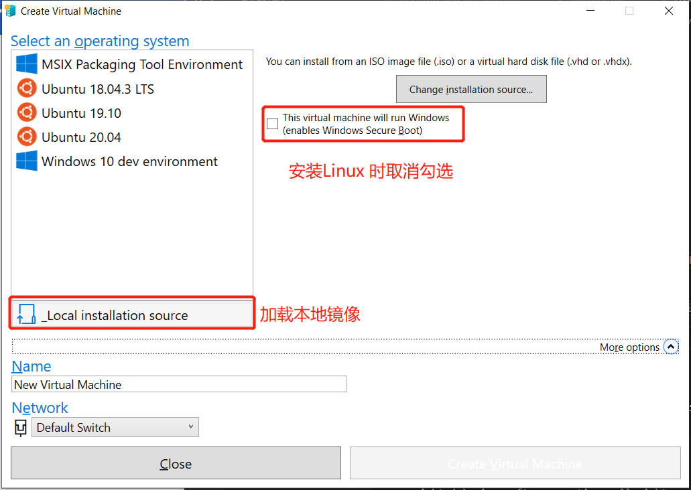
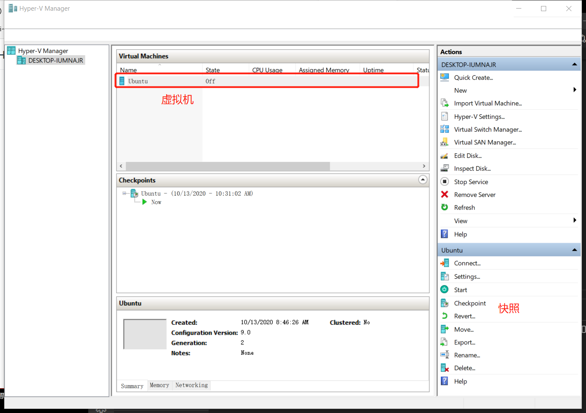

---
title: Hyper-V
sidebar: auto  
tags:  
    - virtual  
    - bios  
    - windows  
    - linux  
--- 

# Hyper-V  
## 安装  
### 前提条件  
1. 在`BIOS` 中开启硬件虚拟化支持  
2. 在`控制面板` --> `打开或关闭功能` 启用`Hyper-V` 和`.Net3.5`  

### 快速安装  
1. 快速创建虚拟机：`开始` --> `Hyper-V Quick Create`  
2. 可以选择左边推荐系统，也可以加载本地镜像  
   
3. 如同正常安装操作系统一样即可    

### 管理  
1. `开始` --> `Hyper-V Manager`  
   
2. 我们也可以单击左侧主机名添加  
   1. 虚拟机  
   2. 虚拟硬盘  
   3. 虚拟网络

### 权限管理  
普通用户看不到`Hyper-V` 创建的虚拟机，需要将其添加至`Hyper-V Administrators` 组

## 参考  
1. [Windows 10 上的 Hyper-V](https://docs.microsoft.com/zh-cn/virtualization/hyper-v-on-windows/)
2. [Hyper-v权限配置详细记录](https://blog.csdn.net/dlp/article/details/85000786)