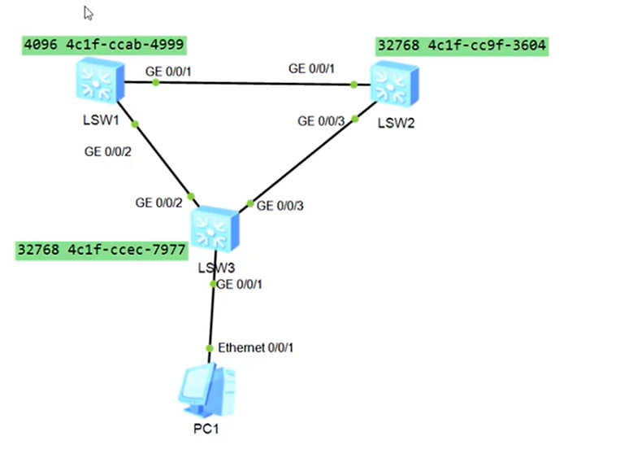

---
title: Spanning-Tree
sidebar: auto
tags: 
    - spanning
---  

## STP  

- 网络中常见的问题：  
  1. 设备的单点故障。一台设备宕机，所有子设备都会失去连接 
  2. 提高网络的稳定性、增加冗余，但是这样可能会造成二层环路  

- 解决方案：
  1. 手动冷备份（一台设备宕机之后手工启用备用设备）  
  2. 热备（通过生成树协议）  

生成树协议会自动阻塞一些接口，来避免环路  

### 种类  
1. STP  
2. RSTP
3. MSTP（应用最广）  
4. PVST+（私有 
5. PVRST+（私有  

### 名词  
- root 根桥  
  - 每个广播域选择一个根桥  
- rp 根端口  
  - 每个`非根桥`设备上选择一个根端口  
- dp 指定端口  
  - 每个段选择一个指定端口  
  - 指定其他接口  
- ndp 非指定端口  

### 角色选取  
1. root：根桥ID（优先级`32768`+MAC），越小越优先  
2. rp：根据到根桥的cost 值。也是跟带宽有关  
   - 10M => 100
   - 100M => 19
   - 1000M => 4
   - 10000M => 2
   - cost 新标准`2*10^7/n(M)`  
   - 相同的cost 值判断上一个节点的桥id，越小越优先  
   - 两台设备对接时，`发送端口`id 越小越优先
3. dp：DP 端口（RP 是接收最优的BPDU 包，DP 是发送？最优的BPDU 包） 
   - 根桥的端口都为DP，发送到其他节点的RP  
   - 每个设备只有一个RP，DP 连接到另一台设备的NDP（阻塞，不再转发数据）  
   - 两台子节点互联之间选取DP，选取原则：  
      1. cost
      2. 本机桥id  
      3. 端口号  

详细步骤见[示例](#示例)  

### 状态  
- `blocking` 华为里面叫discarding 检测到BPDU 丢包，20 秒后到`listening`  
  - NDP 端口虽然会阻塞数据，但是能且只能够接受BPDU 包  
- `listening` 转发延时 15 秒  
- `learning` 转发延时 15 秒  
- `forwarding`

### 优化  
配置了生成树之后，普通的电脑接口也会影响生成树协议，会造成很慢,解决方案：配置快速转发端口 或者edge 边缘端口  
```bash
# 最好不要在全局下配置，而是在具体接口下配置
stp edge-port default 
int f0/0/1
stp edge-port enable

# 思科叫portfast
spanning-tree port fast
```

### 示例  
  
1. 选取root：优先级+MAC，取最小值，选择LSW1  
2. rp：对于LSW2（G0/0/1）;LSW3(G0/0/2)  
3. dp:LSW1 的所有接口都是DP；对于LSW2 和LSW3，因为LSW2 的MAC 地址较小，所以LSW2 的G0/0/3是dp 
4. ndp：LSW3 deG0/0/3


## 参考资料  
1. [哔哩哔哩](https://www.bilibili.com/video/BV1kE411N7JV)  