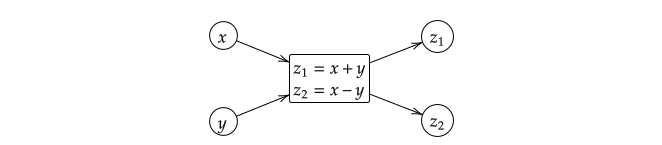
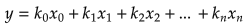
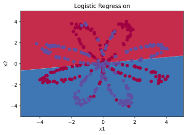

---
title: 我理解的神经网络
---  

## 前言  
我一直希望，能不能有一种非常非常简单、形象的方式，来向人们解释复杂的理论。最好是能用生动的比喻、连同它的历史一起、娓娓道来。这种方式一定非常适合人们对事物的理解的习惯吧。

也许这是一个死胡同，走到某一步便走不下去了。也许这也是前人走过无数遍的道路，只不过谁也不曾注意到路边的野花。我更愿意说这是一种思维方式，中间掺杂着我大学以来学习、思考的结果。边走边看吧。

## 函数与黑盒子  
让我们回到初中的数学课堂，回忆一下什么是函数。大概的定义是一组数据到另一组数据的映射。但是以一个未知的概念去定义另一个未知的概念是一件很危险的事情：什么是映射呢？

### 单输入单输出函数  
不妨让我们将函数看作一个黑盒子，包含一个数据入口和一个数据出口的黑盒子。盒子内部会进行一系列的加工处理工作，比如：将输入的数据值增加1，并输出到外界。那我们就可以将这个函数的功能用数学公式表示：对于输入`x`，经过函数的处理后会输出`y=x+1`。好巧不巧，函数的英文名字是`function`，也刚好有“功能”的意思。  


### 多输入多输出函数  
更进一步，我们可以定义另一个盒子，包含两个输入`x,y`和两个输出`z1,z2`，其中`z1=x+y; z2=x-y`。当`y` 的值被锁定为`1` 时，`z1=x+1` 退化为上文提到的[单输入单输出函数](#单输入单输出函数)。  
  
多输入单输出的函数在生活中也比较常见，比如：安全要求比较高的门禁系统，要同时插入两把钥匙才能打开；计算机中的调色板通过设置`R,G,B` 的值来唯一确定一种颜色；听到下课铃并且到饭点了才能去食堂吃饭。想一想，现实生活中可以总结出规律的事情，基本都能用一个多输入的黑盒子模块表示。

一般来说我们设计系统时，要求尽量做到模块化，新增的模块（黑盒子）对原有的系统不要有侵入（即不要影响本来系统的函数式），这样的模块能够做到即插即用。对于每一个模块而言，需要尽量做到输出对于输入没有影响，就算有，我们也能通过传递函数化简（概念取自于自动控制原理），将系统在概念层面化简为新的独立的模块构成。

## 统计与拟合  
自然界中一般会存在两种函数：已知的和未知的。像电压-电流关系`U=I*R`、牛顿第二定律`F=ma`、单位圆上的点（与角/弧度相关）到`x` 轴的投影`y=cos(x)`是已知的函数，我们能直接写出它们的函数式；另一种如股票价格变动、声音的波形、汽车油耗随速度的变化，不排除它们按某些规律变化，但是由于影响的因素过多，我们难以找到一个精确的函数式来表示他们的变化。
对于不知道确切函数式的函数，如果我们想知道某一段输入对应着输出变化的规律则需要用到统计学的方法了。这里的统计学并不包括概率，因为概率的概念还是太抽象了点。

### 散点图  
如果我们想要看到某段输入内，输出的变化趋势。我们可以将所有的输入输出点记录下来，如果记录的点足够多、分布足够均匀，就能得到较为精确的函数图像。实际上计算机作图也是通过这个原理，当离散的点足够密集时，就可以看成一条连续的线了。  


### 插值法  
自然界中的信号，一般都是连续变化的，不会突然产生跳变。这就说明，对于两次间隔比较小的输入，其输出一般也差距较小。于是，对于某一个输入值`x1`，可以说其对应的输出取`y1=(y0+y2)/2`。这便是最简单的插值法。 
  
 

### 最小二乘法  
插值法可以较快地求取某一点的函数值，但是其受采样点的影响比较大，对多输入函数的效果不理想。最重要的是，我们想要一个通用的函数式来表示某个模块的功能。这时候我们就可以根据[散点图](#散点图)中的函数图像，来假设一个近似的函数方程`f(x)`：参数的系数不固定，通过计算采样点到`f(x)`的竖直（比较好算）距离的最小值，来唯一确定一组系数，进而得到一条相对比较理想的曲线来拟合模块的函数式。这便是最小二乘法。  
  

以上图为例，采样点分别为：`(x,y)∈{(0,1),(2,2.5),(3,4.5),(4,5),(5,6)}`，我们需要假设直线`y=kx+b`。则某一个采样点`(xi,yi)`到该直线的竖直距离就是`di=|yi-y(xi)|`。为了便于计算，我们可以用平方去掉绝对值符号，求所有`di²`的和`D`的最小值。这里我们可以用`Python`的`Sympy`库来帮助求解得到`D`关于`(k,b)`变化的函数；或者直接利用`Matlab`求出相应的`(k,b)`。   

<CodeGroup>
<CodeGroupItem title="Python">

```python
# pip install Sympy
from sympy import *  
k,b = symbols('k b')  # 定义符号变量  
sum = simplify(
    (1.0 - (0.0*k+b))**2 +  # (0,1)
    (2.5 - (2.0*k+b))**2 +  # (2,2.5)
    (4.5 - (3.0*k+b))**2 +  # (3,4.5)
    (5.0 - (4.0*k+b))**2 +  # (4,5)
    (6.0 - (5.0*k+b))**2    # (5,6)
)
print(latex(sum))
# 5.0 b^{2} + 28.0 b k - 38.0 b + 54.0 k^{2} - 137.0 k + 88.5
```    

</CodeGroupItem>

<CodeGroupItem title="Matlab">

```matlab
x=[0,2,3,4,5]
y=[1,2.5,4.5,5,6]
plot(x,y,'o')  %% 作散点图
k_b=polyfit(x,y,1)
%% k_b = 1.0338    0.9054
```

</CodeGroupItem>
</CodeGroup>

`D`关于`(k,b)`变化的函数图像如下：  
  

最终曲线的方程为`y=1.0338x+0.9054`，和想象中稍微有些出入，但是随着采样点的增多，该数值会越来越准确。  

### 梯度下降  
除了使用`Matlab` 等工具外，还有没有其他办法可以求`D`的最小值呢？分别求`D`关于`k,b`的偏导数，对于这个例子，偏导数全部为`0`时，`D`取到最小值。  
然而对于计算机来说，求数值解要比求解析解更加简单，毕竟计算机就是用来计算的、而不是用来思考的。  

如何求数值解？我们先假设上图中有任意一点`(ki,bi)`，只要让这个点始终沿着`D`减小的方向移动一点点`𝛿`就好了。也就是说应该始终沿着偏导数`<∂k,∂b>`向量相反的方向移动。  
  
其中，`<∂k,∂b>`被称作梯度，完整的写法如下：  
  
这种通过梯度迭代的方法也就叫做**梯度下降法**。也是神经网络中最重要的概念之一。


## 最小二乘法的扩展  
上面的例子中，我们只对单输入单输出的函数进行了拟合，最终得到了一组系数`(k,b)`来确定了一条直线。那么如果是多输入单输出、或者是非直线的函数应该怎么拟合呢？  

### 高维形式
对于二维平面中的点我们可以用一维的线取拟合；对于三维空间中的点我们可以用二维的平面去拟合；对于`n` 维空间中的点，我们则可以用`n-1` 维的超平面去拟合。形式如下：  
  
其中`xi`作为输入项的集合 ，一般取`k0*x0=k0`作为常数项。  

### 拟合曲线  
即使是高维最小二乘法也只能拟合直线、平面。如果函数的输出并不是分布在一条直线、平面上（如下图），该怎么办呢？
  

这里用`线性`一词来表示直线变化的情形。我们假设（构造）另一个函数`g(x)=ln(x)`，那么`y~g` 就是线性变化的了。所以对于非线性的数据，我们可以根据数据变化的规律，来构造一个函数，使其非线性化。相当于加了一个线性-非线性转换的环节，然后再进行最小二乘法处理。  

这里的非线性函数一般被称为**激活函数**。人类的神经元一般当外界的信号打到某一个值的时候才会被激活，而且输出与输入并不一定是线性关系。这里看来的话叫做激活函数还是挺形象的。

### 复合函数  
再者，如果函数图像比较复杂，那我们可以通过用一组或者多组简单的函数图像叠加来进行拟合。这里很容易想到级数的概念，事实上道理是一样的。例如：`y=tanh(2sin(x)+1)-tanh(sin(x+1))+1`的图像是下图中最粗的蓝色曲线，它是由一系列简单函数依次传递组成的。  
  
而对应的函数间的传递方式如下：  


#### 复合函数求导  
对于复合函数的求导过程，我们有公式：
  
偏导数的求法也是一样，分别求出每一步的导数，最后乘起来就是最终的导数。  

### 误差函数  
前面我们使用了平均值，数值距离的最小值来表示拟合的程度。其实我们还可以选择其他的函数作为误差函数。例如：我们可以选择点到直线的距离、点到平面的距离等等。但是只要保证一条：最终的误差函数在定义域内应该有且只有一个最小值。否则在使用梯度下降时可能会陷入某一个局部最优解。也就是说误差函数`D` 最好像下图的左边而不是右边： 


## 向量与矩阵  
来看一个鸡兔同笼问题：今有鸡兔同笼，共有头36，脚48，问鸡、兔各几何？易得兔12、鸡24；再问：今笼有俩鸡仨兔，问有头、脚各几何？

### 特征与向量  
在此例中，我们可以分别用一组数据来代表鸡和兔的特征：`1（头），2（脚）；1（头），4（脚）`。我们一般管这样一组数据叫做**特征向量**。顾名思义，表示特征的有方向的量。  
  

对于两个向量张成的空间，我们一般称为面积；三维的叫做体积。面积可以表示空间的大小，也可以表示为两个向量平行的程度。因为`S=|a||b|sin(α)`，`α`表示向量`a,b`之间的夹角。向量正确的写法应该是字母上面有一个箭头，但是`markdown` 内似乎不支持这种写法：

### 矩阵与行列式  
回到最初的问题，我们可以列一个表格A 来表示鸡兔两个特征向量的组合；用另一个表格表示笼的特征向量`2（鸡）3（兔）`。然后问题就变成了，我们需要用`头，脚`来表示笼的特征。    


先计算头的特征`h=1x2+1x3=5`，再计算脚的特征`f=2x2+4x3=16`。可以总结出，A 的每一行与B 的每一列的对应项相乘之和就是最后的结果，记作矩阵的乘法`C=AB`。    
看到这里是不是觉得特熟悉。矩阵乘法里面每一行的运算和多项式的运算形式一模一样：  
提示：把`x` 看作行、把`k` 看作列。

### Numpy中的矩阵运算  
在`numpy` 中定义了一系列的矩阵运算函数，这里简单整理几个常用的，后续再慢慢增加。  


```python
import numpy as np  
x = np.array([1,2,3])  # 定义行向量
# [1, 2, 3]

x = x.reshape(3, -1)  # 重新排列元素  
# 重新排列为3 行矩阵，列数`-1`表示由函数计算决定有多少列  

y=0.5
y=x*y  # 矩阵A*B 表示对应元素相乘
# y 会被自动扩展为尺寸同x，元素全部为0.5 的矩阵  
# 此操作成为广播
# +,-,*,/,power,log,sqrt,log 等运算均适用  

z=x.dot(y.T+1)  # 矩阵乘法  
# 即上面鸡兔同笼问题推导出来的矩阵乘法 
# .T 表示矩阵的转置  
'''z=
[[1.5 2.  2.5]
 [3.  4.  5. ]
 [4.5 6.  7.5]]
'''

print(z.mean(axis=0))  # 输出平均值  
# axis 表示矩阵的维度序号
# [3. 4. 5.]
print(z.mean(axis=1))  # 对照z 的值理解
# [2. 4. 6.]
# 不是太好理解，大致表示对第n 层的元素求平均值

np.zeros((row, col))  # 初始化0 矩阵
np.around(z)  # 四舍五入  
z.flatten()  # 平坦化，按某种顺序转化为行向量，一般是按C 数组的方式  
```

## 单神经元网络  
其实神经网络要做的，也只是构造一个函数，去拟合一段数据的变化情况罢了。只不过我们让电脑利用[梯度下降](#梯度下降)的办法逐渐调整最优系数组合。下面我们还是以[最小二乘法](#最小二乘法)中的数据为例，来看看神经网络的构造过程与工作原理。  

### 梯度下降的最小二乘法  
  
首先提取计算需要用到的信息：  
- 采样次数`n`：5  
- 输入特征向量的维度`m`：1  
- 输入数据`X`：`[0, 2, 3, 4, 5]`  
- 输出数据的维度：1  
- 输出数据`Y`：`[1, 2.5, 4.5, 5, 6]`  

然后针对**某一次采样数据**构造函数传递的过程，这里因为输出结果也是线性的，所以激活函数可以取`a(z)=z`，即不做任何处理，相当于一个透明环节。其导数值恒为`1`    
  
而我们的样本数量为5，这样每次计算会得到5 个误差值。一般我们取其平均值作为最终的误差。  

下面是是`Python` 的代码，可以看到随着迭代次数的增加，误差逐渐减小。  
```python
import numpy as np

# 初始化参数  
x = np.array([0,2,3,4,5]).reshape(5, -1)
y = np.array([1, 2.5, 4.5, 5, 6]).reshape(5, -1)
k,b=(0,0)
delta=0.01  # 步长不宜过大，否则递归下降的过程会产生震荡

# 线性过程：z=kx+b
def Z(x):      
    return k*x+b
def dz_dk(x):  # z对k 的偏导
    return x
def dz_db(x):  # z对b 的偏导
    return 1

# 激活函数：a=z 由散点图可设激活函数是线性的
def Act(z):    
    return z
def dAct(z):   # 激活函数的偏微分
    return 1

# 误差函数：(y-a)^2，最小二乘法
def Diff(a, y):    
    return (y-a)*(y-a)
def dDiff(a, y):
    return -2*(y-a)

# 反复迭代梯度下降过程
for i in range(10000):
    z = Z(x)       # 求取每一个节点的计算结果
    a = Act(z)
    d = Diff(a, y)
    # 求取误差函数对k,b 的偏微分，每次采样都是不同的
    dd_dk = dDiff(a, y)*dAct(z)*dz_dk(x)  
    dd_db = dDiff(a, y)*dAct(z)*dz_db(x)
    # 梯度下降：每次迭代都会计算四次采样下的平均值
    k = k-delta*dd_dk.mean(axis=0)
    b = b-delta*dd_db.mean(axis=0)
    # 输出第i 次迭代的结果

print(k, b, d.mean(axis=0))
# [1.03378378] [0.90540541] [0.09662162]
```

### 图片中是否有猫  
此题为吴恩达深度学习的课后编程题[Logistic Regression with a Neural Network mindset](https://github.com/Kulbear/deep-learning-coursera/blob/master/Neural%20Networks%20and%20Deep%20Learning/Logistic%20Regression%20with%20a%20Neural%20Network%20mindset.ipynb)。根据图片中的像素信息来判断图片中是否有猫。  

首先还是梳理关键信息：  
- 从图片中读取数据，每张图片包含`3*64*64` 字节数据，也就是有`3*64*64`个维度  
- 用来训练的图片有`209`张；测试用的`50`张  
- 输出是真假，是非线性的，所以需要一个非线性话函数，这里我们用`sigmoid`函数。为了便于计算，一般我们采用`D(a,y)=-(yln(a)-(1-y)ln(1-a))`作为误差函数。  


下面是函数传递的示意图，仅以二维输入示意，实际输入应该是`3*64*64`维：  


除了修改数据初始化、激活函数与误差函数外，我们可以几乎照搬[梯度下降的最小二乘法](#梯度下降的最小二乘法)里面的代码。  
```python
import numpy as np
import matplotlib.pyplot as plt
from PIL import Image
from lr_utils import load_dataset

# 数据加载过程题目已经给出 
delta=0.1  
dim = 3*64*64  # 图片数据维度  
k = np.zeros((dim, 1))
b = np.zeros((1, 1))
len_train = 209
len_test = 50

# 将输入数据归一化，更有利于避免指数运算中的数据溢出
x = (train_set_x_orig.reshape(-1, dim))/255-0.5
y = train_set_y.reshape(-1, 1)
# 测试数据  
tx = (test_set_x_orig.reshape(-1, dim))/255-0.5
ty = test_set_y.reshape(-1, 1)

# 线性过程：z=kx+b
def Z(x):      
    return k*x+b
def dz_dk(x):  # z对k 的偏导
    return x
def dz_db(x):  # z对b 的偏导
    return 1

# 激活函数进行非线性化
def Act(z):
    return 1/(1+np.exp(-z))
def dAct(z):  # 激活函数求导
    a = Act(z)
    return a*(1-a)

# 对数误差函数及其导数
def Diff(a, y):
    return -(y*np.log(a)+(1-y)*np.log(1-a))
def dDiff(a, y):
    return (a-y)/a/(1-a)

# 反复迭代梯度下降过程
for i in range(2000):
    z = Z(x)
    a = Act(z)
    d = Diff(a, y)

    # 这里除以一个较大的数，也是为了避免指数运算时的数据爆炸
    dk = np.dot(dZ_dk(x).T, dDiff(a, y)*dAct(z))/len_train
    db = (dDiff(a, y)*dAct(z)).sum()/len_train
    k = k-delta*dk
    b = b-delta*db

# 以下代码仅作结果分析只用，并不影响神经网络本身的计算
def Res(x, y):
    z = Z(x)
    a = Act(z)
    diff = np.around(np.abs(a-y))
    # 输出准确率
    print(1-diff.sum()/len(x))
    return diff

diff = Res(tx, ty).flatten()
print(ty)

# 绘制识别错误的图像
plt.figure()
for i in range(len(diff)):
    if diff[i] > 0.5:
        plt.subplot(5,10,i+1)
        plt.imshow(test_set_x_orig[i].reshape((64, 64, 3)))

plt.show()
```
通过代码结果可以看出来，模型对训练集的拟合非常好，而对于测试集的准确度最高只有68%，并且像是对训练集过度拟合，以至于只能识别范围比较窄的区域，这可能已经是单个神经元能达到的极限了。

### 实用工具  
在上文代码中，我们可以通过修改某些参数，例如学习率`δ`，来用更少的训练次数得到更好的结果。那么我们还可以通过让机器在一个范围内调整某几个参数、记录并绘制误差随迭代次数的关系图，来帮助我们选择更合适的模型参数。  
```python
# 1. 显示图形
import matplotlib.pyplot as plt
# 1.1 显示单张图片
plt.imshow(img.reshape((w, h, 3))) # RGB 图像的宽和高
# 1.2 显示多张图片
# 绘制识别错误的图像
plt.figure()
for img in range(imgData):
        plt.subplot(n,m,i+1)  # 显示在nxm 张图片的第i 个位置
        plt.imshow(img.reshape((w, h, 3))) # RGB 图像的宽和高
plt.show()

# 2. 绘制曲线图
data = np.squeeze(orgData)  # 删除无关的维度
plt.plot(data)              # 绘图
plt.ylabel('y')             # 添加图片信息
plt.xlabel('x')
plt.title("title")
plt.show()

# 3. 读取图片信息
from PIL import Image
image = Image.open(my_file).convert('RGB')
image = np.array(image)
```
Python 不难学，难的是掌握相关的库函数与基础的理论知识。知其所以然后才能用好Python，所以Python 是一个让人讨厌的强大的工具。  

## 深度学习神经网络  
正如[复合函数](#复合函数)中所展示的，我们可以通过组合不同的线性、非线性函数一步步得到复杂的函数图像。而对于神经网络来说，每一个线性+非线性的函数对就相当于一个神经元节点。通过反复迭代来修改每一个节点的系数，就能得到一组最优系数，让我们的函数模型何以尽可能精确地拟合实际的采样信息。  

对于刚入门的我来说，最难的地方除了Python 之外，还有就是找不到练手的例子与数据。于是只能用吴恩达老师的例题[Planar data classification with one hidden layer](https://github.com/Kulbear/deep-learning-coursera/blob/master/Neural%20Networks%20and%20Deep%20Learning/Planar%20data%20classification%20with%20one%20hidden%20layer.ipynb)做笔记了。为了减少与现有常用符号的冲突，我们将在以后把斜率k，写作权重w。

### 矩阵的微分  
在正式开始之前，让我们再最后学习一遍求微分（导数）的过程。因为对于计算机来说，每一级函数都是有数据输入的，所以在函数正向过程中，就能把对应输入输出的偏微分求解出来。然后再利用复合函数的微分法则，来构造最终的结果即可。  
- 复合函数求导：  
- 矩阵的求导：见下图  
  

### 逻辑回归  
给定的一组数据包含三个维度`(x,y,z)`，其中`z`作为输出。各个数据点之间错综分布，没有明显的分界线。所以通过平面、或者简单的曲面无法拟合这么复杂的关系。所以我们考虑添加一层神经元，看能否得到比较准确的模型。  
  

我们可以得到输入输出数据大小分别是`X=2x400`、`Y=1x400`。在深入之前，我们可以先用`sklearn`内置的逻辑回归来尝试拟合以下。逻辑回归也就是前面所提到的[图片中是否有猫](#图片中是否有猫)问题。与吴恩达老师处理数据的方式不同，我更习惯将数据按行向量的方式存储而非列向量，即需将`X,Y` 分别进行转置处理。  

<CodeGroup>
<CodeGroupItem title="Logistic">

```python
# 代码抄自GitHub
# 省略导入包的过程

np.random.seed(1)  # 初始化随机数

X, Y = load_planar_dataset()
X, Y = X.T, Y.T  # 行列转置

# 训练逻辑回归的分类器
clf = sklearn.linear_model.LogisticRegressionCV()
clf.fit(X, Y)

# 绘制逻辑分类的边界
plot_decision_boundary2(lambda x: clf.predict(x), X, Y)
plt.title("Logistic Regression")

# 打印准确度
LR_predictions = clf.predict(X)
print ('Accuracy of logistic regression: %d ' 
  % float((np.dot(Y.T, LR_predictions) 
  + np.dot(1 - Y.T,1 - LR_predictions)) 
  / float(Y.T.size) * 100) 
  + '% ' + "(percentage of correctly labelled datapoints)")
```

</CodeGroupItem>
<CodeGroupItem title="Plot_Boundary">

```python{8-14}
# 吴恩达老师的例题中采样数据按列横向分布
# 而一般按行纵向分布更好理解，下面是按行分布时绘制边界的代码
def plot_decision_boundary2(model, X, y):  # 这里的模型其实是一个分类器函数
    # 设置绘图范围
    x_min, x_max = X[:, 0].min() - 1, X[:, 0].max() + 1  # x 轴
    y_min, y_max = X[:, 1].min() - 1, X[:, 1].max() + 1  # y 轴
    h = 0.01  # 步长
    # 生成绘图区域网格
    xx, yy = np.meshgrid(np.arange(x_min, x_max, h), np.arange(y_min, y_max, h))
    # 预测值
    Z = model(np.c_[xx.ravel(), yy.ravel()])
    Z = Z.reshape(xx.shape)    
    # 绘制等高线图
    plt.contourf(xx, yy, Z, cmap=plt.cm.Spectral)
    plt.ylabel('x2')
    plt.xlabel('x1')
    plt.scatter(X[:, 0], X[:, 1], c=y, cmap=plt.cm.Spectral)
```

</CodeGroupItem>
</CodeGroup>

这里之所以把这段代码单独拿出来分析，是因为作图也是数据分析中非常重要的部分。学知识的同时还要掌握与之匹配的测试的方法，不然学的对不对都不知道。有了直观的图示，可以让我们更快地分析出问题所在，磨刀不误砍柴功。最终生成的图像如下，一目了然：  
  

### 单个隐藏层  
具有单个隐藏层的神经网络结构如下（以两次采样数据为例，隐藏层有三个神经元）：  
  

代码上面与逻辑回归的变化不大，唯一需要注意的是在层与层之间导数传递时的计算，见[矩阵的微分](#矩阵的微分)  

<CodeGroup>
<CodeGroupItem title="单隐藏层">

```python{5,26}
# 省略数据导入的过程
np.random.seed(2)

# 初始化参数
dim = 40  # 隐藏层的神经元个数，
# 也是第一个权重矩阵的列数
W1 = np.random.randn(2, dim) * 0.01
b1 = np.zeros(shape=(1, dim))
# 由图像可知，上一层权重的列数，等于下一层权重的行数
W2 = np.random.randn(dim, 1) * 0.01
b2 = np.zeros(shape=(1, 1))
learning_rate = 0.1  # 学习率，也是梯度下降的步长

for i in range(10000):
    # 正向过程：隐藏层
    Z1 = np.dot(X, W1)+b1
    A1 = np.tanh(Z1)    
    # 正向过程：输出层
    Z2 = np.dot(A1, W2)+b2
    A2 = sigmoid(Z2)
    lost = np.multiply(np.log(A2), Y) + np.multiply((1 - Y), np.log(1 - A2))
    
    # 反向过程：输出层
    dZ2 = A2-Y
    dW2 = np.dot(A1.T, dZ2)/len(dZ2)
    dA2 = np.dot(dZ2, W2.T)  # 层间导数传递
    db2 = dZ2.mean(axis=0)/len(dZ2)
    # 反向过程：隐藏层
    dZ1 = np.multiply(dA2, 1 - np.power(A1, 2))
    dW1 = np.dot(X.T, dZ1)/len(dZ1)
    db1 = dZ1.mean(axis=0)/len(dZ1)

    # 更正系数
    W1 = W1 - learning_rate * dW1
    b1 = b1 - learning_rate * db1
    W2 = W2 - learning_rate * dW2
    b2 = b2 - learning_rate * db2


# 最终的神经网络模型
def model(X):
    Z1 = np.dot(X, W1)+b1
    A1 = np.tanh(Z1)
    Z2 = np.dot(A1, W2)+b2
    A2 = sigmoid(Z2)
    return np.around(A2)

# 输出准确率
c = (1-np.sum(np.abs(Y-model(X)))/len(X))*100
# 绘制边界图
plot_decision_boundary2(lambda x: model(x), X, Y)
plt.title('Single Hidden Layer with %s nodes(%s%%)'%(dim,c))
```  

</CodeGroupItem>
<CodeGroupItem  title="双隐藏层">

```python{4-10,16-19,21-24,26-29,39-40,46-50}
# 仅标出与单隐藏层改动的部分
np.random.seed(2)

d1, d2 = 10, 10
W1 = np.random.randn(2, d1) * 0.01
b1 = np.zeros(shape=(1, d1))
W2 = np.random.randn(d1, d2) * 0.01
b2 = np.zeros(shape=(1, d2))
W3 = np.random.randn(d2, 1) * 0.01
b3 = np.zeros(shape=(1, 1))
learning_rate = 0.1

for i in range(40000):
    Z1 = np.dot(X, W1)+b1
    A1 = np.tanh(Z1)
    Z2 = np.dot(A1, W2)+b2
    A2 = np.tanh(Z2)
    Z3 = np.dot(A2, W3)+b3
    A3 = sigmoid(Z3)
    # lost = np.multiply(np.log(A2), Y) + np.multiply((1 - Y), np.log(1 - A2))
    dZ3 = A3-Y
    dW3 = np.dot(A2.T, dZ3)/len(dZ3)
    dA3 = np.dot(dZ3, W3.T)
    db3 = dZ3.mean(axis=0)/len(dZ3)
    
    dZ2 = np.multiply(dA3, 1 - np.power(A2, 2))
    dW2 = np.dot(A1.T, dZ2)/len(dZ2)
    db2 = dZ2.mean(axis=0)/len(dZ2)
    dA2 = np.dot(dZ2, W2.T)

    dZ1 = np.multiply(dA2, 1 - np.power(A1, 2))
    dW1 = np.dot(X.T, dZ1)/len(dZ1)
    db1 = dZ1.mean(axis=0)/len(dZ1)

    W1 = W1 - learning_rate * dW1
    b1 = b1 - learning_rate * db1
    W2 = W2 - learning_rate * dW2
    b2 = b2 - learning_rate * db2
    W3 = W3 - learning_rate * dW3
    b3 = b3 - learning_rate * db3


def model(X):
    Z1 = np.dot(X, W1)+b1
    A1 = np.tanh(Z1)
    Z2 = np.dot(A1, W2)+b2
    A2 = np.tanh(Z2)
    Z3 = np.dot(A2, W3)+b3
    A3 = sigmoid(Z3)
    return np.around(A3)
    
pdb(lambda x: model(x), X, Y)
c = (1-np.sum(np.abs(Y-model(X)))/len(X))*100
plt.title('2 Hidden Layer with %s-%s nodes(%s%%)' % (d1,d2, c))
```

</CodeGroupItem>
</CodeGroup>


通过测试不同的神经元数量，可以得到不同的边界图，如下：  
   

更多层的神经网络也是以此类推，这便是深度学习神经网络的基本原理。至于以后，基本是基于此原理的扩展与修补。  

