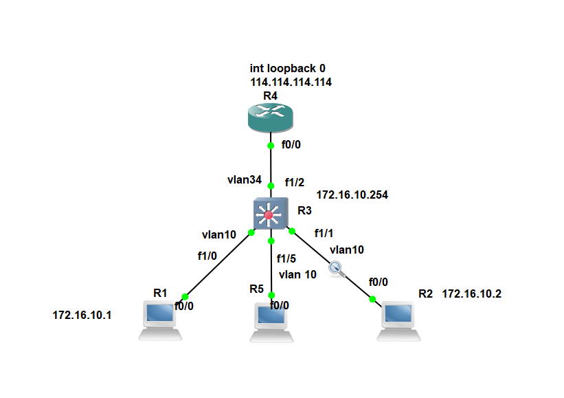

## 访问控制列表  
### 作用  
过滤，抓取数据，但是ACL 会影响设备性能  

### 动作  
- 允许：permit  
- 拒绝：deny  
- 日志：logging  

### 使用场景  
- VPN  
- 路由过滤  
- NAT  

### 小技巧  
- 标准acl 只能匹配源地址  
- 扩展acl 支持匹配源地址、目的地址、端口号、协议等  
- acl 是自上而下顺序匹配的  
- acl 的步长一般应为10，为了便于后面插入新的规则  
- 核心交换机最好不要配置任何ACL，单一功能  

## 示例  
 

### 配置  
```bash
R1#conf t
Enter configuration commands, one per line.  End with CNTL/Z.
R1(config)#no ip routing
R1(config)#int f0/0
R1(config-if)#ip add 172.16.10.1 255.255.255.0
R1(config-if)#no sh
*Mar  1 00:01:18.887: %LINK-3-UPDOWN: Interface FastEthernet0/0, changed state to up
*Mar  1 00:01:19.887: %LINEPROTO-5-UPDOWN: Line protocol on Interface FastEthernet0/0, changed state to up
R1(config-if)#exit
R1(config)#ip default-gateway 172.16.10.254
R1#ping 172.16.10.1  

# R2 与R1 的配置大同小异  

# R3   
# 创建vlan
Router#conf t
Enter configuration commands, one per line.  End with CNTL/Z.
Router(config)#vlan 10
Router(config-vlan)#exit
Router(config)#int vlan 10
Router(config-if)#ip add 172.16.10.254 255.255.255.0
Router(config-if)#no sh
Router(config-if)#exit

# 给vlan 添加接口
Router(config)#int range  f1/0 - 1
Router(config)#switchport mode access
Router(config-if-range)#switchport access vlan 10
Router(config-if-range)#no sh
Router(config-if-range)#exit  

Router#show vlan-switch brief

VLAN Name                             Status    Ports
---- -------------------------------- --------- -------------------------------
1    default                          active    Fa1/2, Fa1/3, Fa1/4, Fa1/5
                                                Fa1/6, Fa1/7, Fa1/8, Fa1/9
                                                Fa1/10, Fa1/11, Fa1/12, Fa1/13
                                                Fa1/14, Fa1/15
10   VLAN0010                         active    Fa1/0, Fa1/1
1002 fddi-default                     act/unsup
1003 token-ring-default               act/unsup
1004 fddinet-default                  act/unsup
1005 trnet-default                    act/unsup

# 配置上联接口  
Router#conf t
Enter configuration commands, one per line.  End with CNTL/Z.
Router(config)#int f1/2
Router(config-if)#no switchport  # close switch function,not reccomended 
Router(config-if)#
*Mar  1 00:11:54.607: %LINEPROTO-5-UPDOWN: Line protocol on Interface Vlan1, changed state to down
*Mar  1 00:11:56.635: %LINEPROTO-5-UPDOWN: Line protocol on Interface FastEthernet1/2, changed state to up
  
Router(config)#vlan 34
Router(config-vlan)#exit
Router(config)#int vlan 34
Router(config-if)#ip add 172.16.34.3 255.255.255.0

# R4
R4#conf t
Enter configuration commands, one per line.  End with CNTL/Z.
R4(config)#int f0/0
R4(config-if)#ip add 172.16.34.4 255.255.255.0
R4(config-if)#no sh
R4(config-if)#exit

# vlan: access, input add a tag; out put get rid of a tag

R4#conf t
Enter configuration commands, one per line.  End with CNTL/Z.
R4(config)#int loopback 0
R4(config-if)#ip add
*Mar  1 00:21:06.731: %LINEPROTO-5-UPDOWN: Line protocol on Interface Loopback0, changed state to up
R4(config-if)#ip add 114.114.114.114 255.255.255.255
R4(config-if)#exit
R4(config)#exit
R4#ping 1
*Mar  1 00:21:27.751: %SYS-5-CONFIG_I: Configured from console by console
R4#ping 114.114.114.114

Type escape sequence to abort.
Sending 5, 100-byte ICMP Echos to 114.114.114.114, timeout is 2 seconds:
!!!!!
Success rate is 100 percent (5/5), round-trip min/avg/max = 1/1/1 ms


#######################################
# 在R3 配置ACL  
#######################################
Switch#conf t
Enter configuration commands, one per line.  End with CNTL/Z.
Switch(config)#ip access-list extended ?
  <100-199>    Extended IP access-list number
  <2000-2699>  Extended IP access-list number (expanded range)
  WORD         Access-list name

Switch(config)#ip access-list extended acl_name ?
  <cr>

Switch(config)#ip access-list extended acl_name
Switch(config-ext-nacl)#?
Ext Access List configuration commands:
  <1-2147483647>  Sequence Number
  default         Set a command to its defaults
  deny            Specify packets to reject
  dynamic         Specify a DYNAMIC list of PERMITs or DENYs
  evaluate        Evaluate an access list
  exit            Exit from access-list configuration mode
  no              Negate a command or set its defaults
  permit          Specify packets to forward
  remark          Access list entry comment

Switch(config-ext-nacl)#10 permit ip ?
  A.B.C.D  Source address
  any      Any source host
  host     A single source host

Switch(config-ext-nacl)#10 permit ip 172.16.10.1 0.0.0.0 ?
  A.B.C.D  Destination address
  any      Any destination host
  host     A single destination host

Switch(config-ext-nacl)#10 permit ip 172.16.10.1 0.0.0.0 host 172.16.10.2 ?
  dscp        Match packets with given dscp value
  fragments   Check non-initial fragments
  log         Log matches against this entry
  log-input   Log matches against this entry, including input interface
  option      Match packets with given IP Options value
  precedence  Match packets with given precedence value
  reflect     Create reflexive access list entry
  time-range  Specify a time-range
  tos         Match packets with given TOS value
  <cr>

Switch#show ip access-lists
Extended IP access list acl_name
    10 permit ip host 172.16.10.1 host 172.10.1.2

######应用#####
int vlan 34
# 出栈、入栈
ip access-group guolv in/out
# acl 默认会拒绝any 作为垫底策略，华为是允许所有
```


## 参考资料  
1. [哔哩哔哩](https://www.bilibili.com/video/BV1kE411N7JV)  